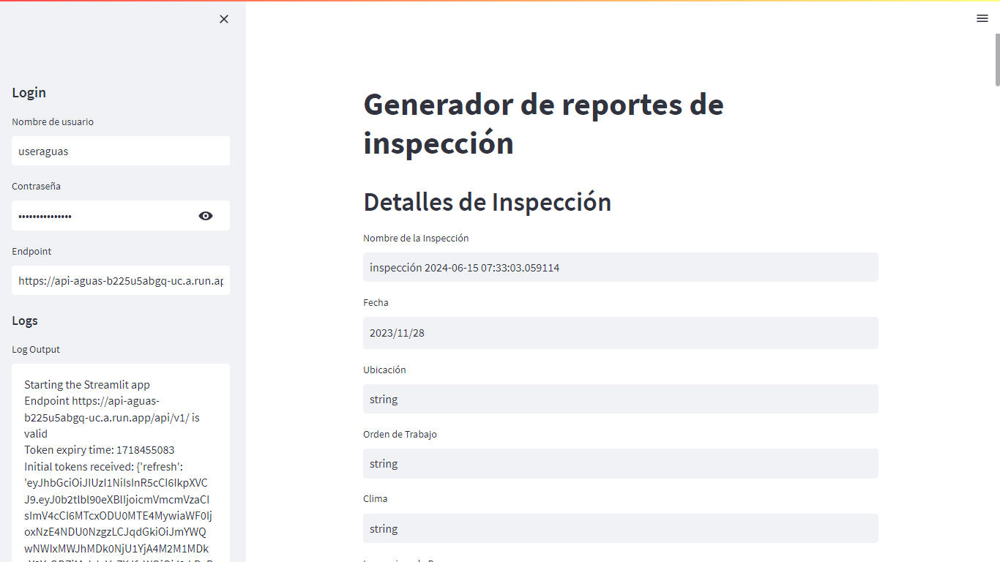
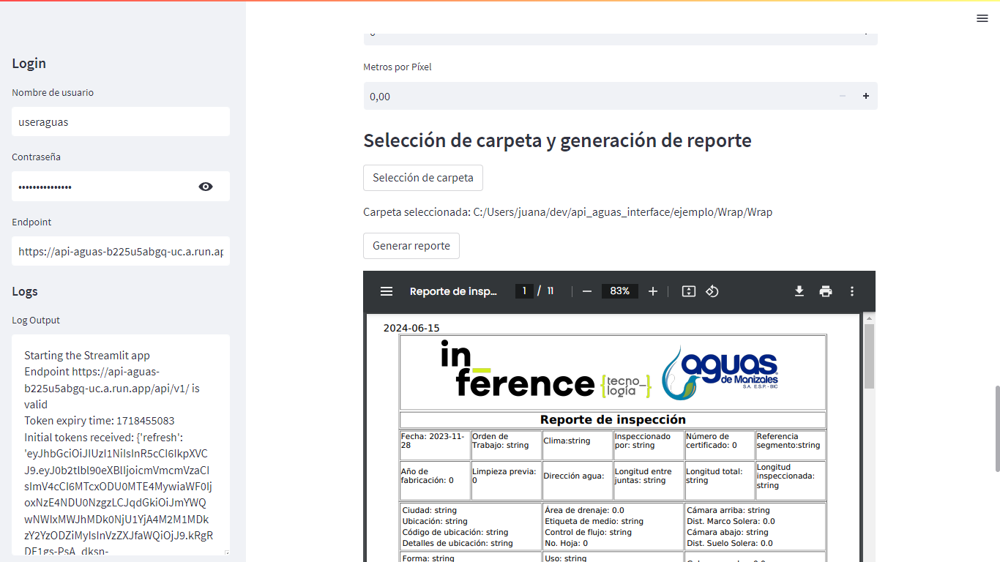

# Simple Interface for Aguas API




## Installation
To install the Simple Interface for Aguas API, run the following command:


```pip install -U git+https://github.com/aguirrejuan/api_aguas_simple_interface```

## Usage
After installation, execute the following command in the terminal:


```api_aguas_interface```

This command will launch a Streamlit app in your browser. Within the app, you can enter the required information, select the folder where the images are located, and generate the report.

Once the process is complete, a link to download the report will be provided. Additionally, the report will be saved in the location where you executed the initial command.